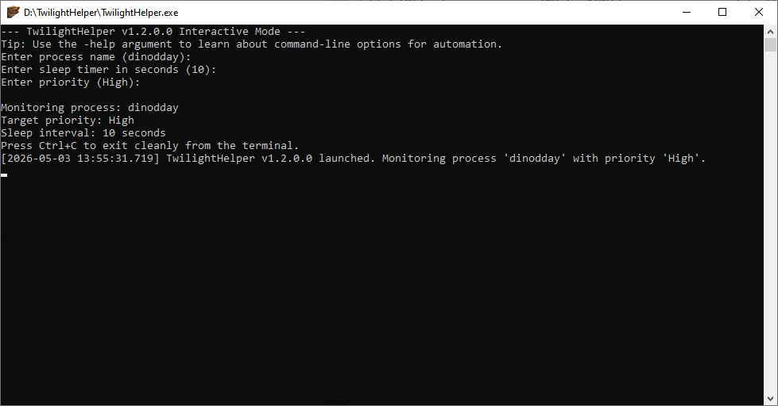

# TwilightHelper
A simple command line tool for automatically setting a process priority. Made it for a friend playing dino d day on an old computer.

## Version Info
* **V2.x**: The current version - it features a system tray icon which can be used to toggle the main console window visibility. Can also auto-hide after launching.
* **V1.x**: A simple console application version without a system tray icon. More lightweight. [Check out the V1 branch](https://github.com/drone1400/twilight-helper/tree/master-V1) for the source code for that version.


Check the [Changelog](changelog.md) for details on version history.




# How to use
Simply run the program, and you will be prompted to enter the process name, priority, and sleep interval in seconds. Alternatively, you can also use command line arguments to configure these.

For the process name, sleep and priority options, if you omit specifying any value, then the default values shown in parentheses will be used.

Example:
```
--- TwilightHelper Interactive Mode ---
Tip: Use the -help argument to learn about command-line options for automation.
Enter process name: dinodday
Enter sleep timer in seconds (10): 
Enter priority (High): 

Monitoring process: dinodday
Target priority: High
Sleep interval: 10 seconds
```

## Command Line Arguments
The program takes the following arguments:
* `-help` or  `-h` - Display a help message
* `-name` or `-n` followed by `<ProcessName>` - The name of the process to monitor
* `-priority` or `-p` followed by `<Priority>` - The priority to set (default: High); Possible values: 
  * `Idle` - Specifies that the threads of this process run only when the system is idle, such as a screen saver. The threads of the process are preempted by the threads of any process running in a higher priority class.
  * `BelowNormal` - Specifies that the process has priority above Idle but below Normal.
  * `Normal` - Specifies that the process has no special scheduling needs.
  * `AboveNormal` - Specifies that the process has priority above Normal but below High.
  * `High` (Default value) - Specifies that the process performs time-critical tasks that must be executed immediately, such as the Task List dialog, which must respond quickly when called by the user, regardless of the load on the operating system. The threads of the process preempt the threads of normal or idle priority class processes.
  * `RealTime` - Specifies that the process has the highest possible priority. (NOTE: this will probably not work unless you run it as administrator)
* `-sleep` or `-s` followed by `<Seconds>` - The sleep interval between checks in seconds (default: 10)

## Example Command Line Argument Usage

`TwilightHelper.exe -name dinodday -priority High -sleep 30` - this will monitor for the dinodday process and check every 30 seconds if the process needs to be set to High priority.

`TwilightHelper.exe -name dinodday` - this will monitor for the dinodday process and check every 10 seconds if the process needs to be set to High priority. 

`TwilightHelper.exe -help` - this will display the help message which looks something like this:

```
TwilightHelper Usage:
  -name, -n <ProcessName>
      The name of the process to monitor
  -priority, -p <Priority>
      The priority to set (default: High)
      Possible values:
          Idle, BelowNormal, Normal, AboveNormal, High, RealTime
      NOTE: setting priority to RealTime is not recommended and
          might require elevated privileges
  -sleep, -s <Seconds>
      The sleep interval between checks in seconds (default: 10)
  -help, -h
      Display this help message

Example:
  TwilightHelper.exe -name dinodday -priority High -sleep 10
  TwilightHelper.exe -name dinodday
```

